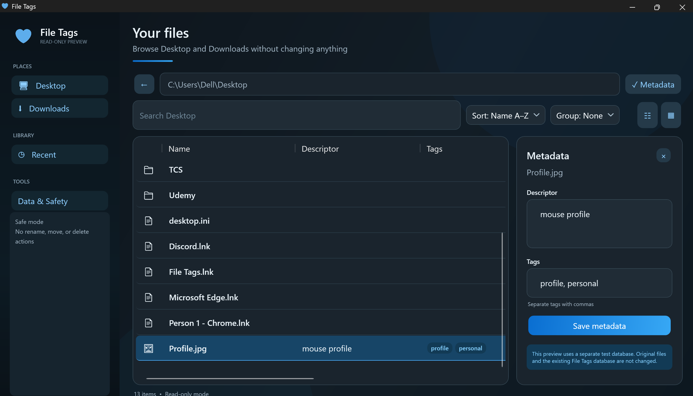
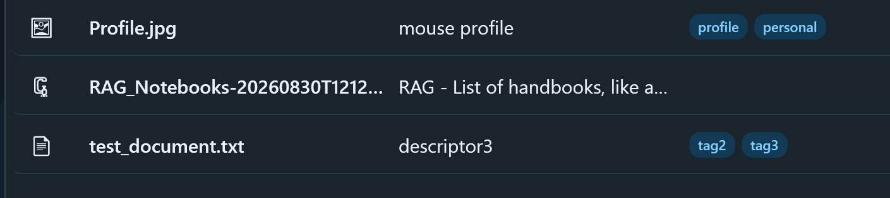

# File Tags

File Tags is a local Windows desktop application for adding memorable descriptions and searchable tags to files. It provides a familiar file-browser interface for Desktop and Downloads without adding rename, move, or delete actions.

> **Current preview:** V1.0.4 for 64-bit Windows. This portable preview is unsigned, so Microsoft Defender SmartScreen may show an **Unknown publisher** warning.



Descriptors and tags appear directly in the file list:



## What it does

- Browse Desktop, Downloads, and their subfolders.
- Add a free-form descriptor and comma-separated tags to a file.
- Search names, descriptors, tags, file types, availability, and paths.
- Sort and group the file list.
- Switch between details and grid views.
- View recently opened or tagged files, retained for 18 days and capped at 50 entries.
- Open files with their normal Windows application.
- Copy a file's path, name, descriptor, or tags from the right-click menu.
- Optionally add **Edit File Tags** to Windows File Explorer's **Show more options** menu.
- Export and restore metadata using a readable JSON backup.
- Check metadata health and rebuild the local search index.
- Remove File Tags safely while preserving attached metadata by default.

## Download V1.0.4

[Download the latest File Tags release](https://github.com/NanditaVenkur/file-context/releases/latest)

SHA-256:

```text
7919F56F2B936DF9DA2AD1E2561798338E195C51D61327D93658FEDFFF3FCDDE
```

The application is self-contained, so the .NET SDK and runtime do not need to be installed separately.

## Install the portable preview

1. Download the V1.0.4 ZIP.
2. Optionally verify its SHA-256 checksum.
3. Extract the complete archive into a permanent folder, such as `%LOCALAPPDATA%\Programs\FileTags-V1.0.4`.
4. Run `FileTags.exe`.
5. On first launch, choose whether to add File Tags to the current user's File Explorer menu.

Do not move `FileTags.exe` after enabling Explorer integration. The Explorer command points to that exact location. If it is moved, open **Data & Safety** and enable the command again from the new copy.

## File Explorer integration

The first normal launch shows a one-time prompt. Selecting **Enable** creates a current-user command; it does not require administrator access or restart Windows Explorer.

On Windows 11:

1. Right-click a file.
2. Select **Show more options**.
3. Select **Edit File Tags**.

The integration can be enabled or disabled later under **Data & Safety**.

## How metadata is stored

The source metadata is UTF-8 JSON stored in an NTFS alternate data stream named `FileTags`:

```text
<file path>:FileTags
```

SQLite provides the local searchable index under `%LOCALAPPDATA%\FileTagsNative`. The index can be rebuilt from ADS metadata discovered under Desktop and Downloads.

### ADS portability warning

Alternate data streams are an NTFS feature. Descriptions and tags may be lost when files are copied through:

- FAT32 or exFAT drives
- Archives such as ZIP files
- Cloud services that do not preserve NTFS streams
- Non-Windows systems
- Programs that replace a file instead of updating it in place

Use **Data & Safety → Export JSON backup** before transferring important tagged files.

## Privacy and safety

- No account is required.
- Filenames, paths, descriptors, and tags are not uploaded.
- No telemetry is collected.
- V1.0.4 does not perform network update checks.
- Ordinary files are not renamed, moved, or deleted by the application.
- Normal use does not require administrator access.
- SQLite is treated as a rebuildable index rather than the only metadata copy.

## Removing File Tags

Open **Data & Safety → Remove File Tags from this computer**.

By default, the removal workflow can remove the File Explorer command and the local SQLite index/preferences. Descriptors and tags attached to files are preserved by default. Bulk ADS removal must be explicitly selected, requires typing `REMOVE METADATA`, and shows a second confirmation.

If the application cannot open, run `emergency_cleanup.cmd` from the extracted folder. It removes the current-user Explorer registration and local File Tags data while preserving attached metadata. You can then delete the extracted application folder manually.

## Current limitations

- Windows x64 only.
- The preview is unsigned and may trigger SmartScreen warnings.
- Folder metadata is not supported.
- Cross-drive and USB moves are not reconnected automatically.
- JSON restore currently expects the recorded absolute file paths.
- Windows 11's modern primary context menu is not yet supported; integration appears under **Show more options**.
- This is a portable preview, not an MSIX or Setup installer.

## Roadmap

Potential later work includes a signed MSIX release, Microsoft Store distribution, previewable cross-computer path remapping, a Locate File workflow, broader drive support, and modern Windows 11 Explorer integration.

## Author

Created by **Nandita Venkatesh Kurinchi**.
